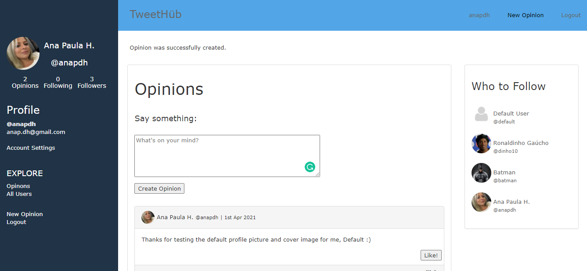
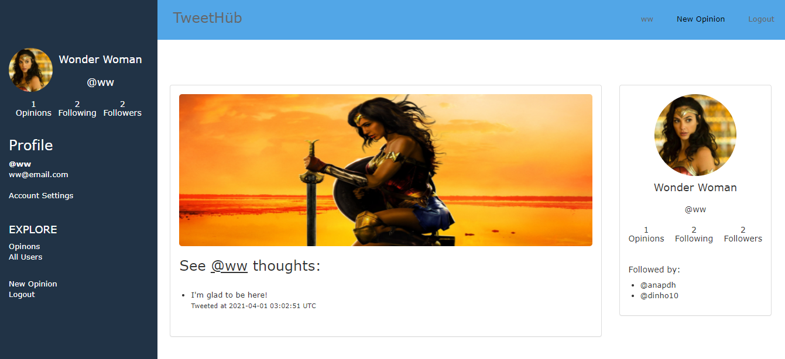

  

This is the final project for Ruby on Rails Microverse's Module: a **Twitter Clone**.

# TweetHub
Features on this project:

1. After creating an account, a user can log in to the app only by typing the username and password.

2. The user is presented with the homepage that includes:
    - Left-side menu with current user information and main navigation.
    - All *Tweets/Opinions* in the center of the screen, as the main content.
    - Right-side section with *Who to follow*.
    - More information about a user when clicking on its profile.

3. The *Tweets* section includes:
    - Simple form for creating a tweet.
    - List of all tweets (sorted by most recent) that display tweet text and author details.

4. The *Who to follow* section includes:
    - List of profiles that are not followed by the logged-in user (ordered by most recently added).

5. When the user opens the profile page, they can see:
    - Left-side menu.
    - Cover picture and *Tweets* tab in the center.
    - Right-side section with *Profile detailed info.*

6. The *Profile detailed info* section includes:
    - User photo.
    - Button to follow a user.
    - Stats: total number of tweets, number of followers and number of following users.
    - List of people who follow this user (only if there are any followers).

7. *Additional feature*:
    - Users can upload a profile picture and cover image from their computer when signing up or when editing the account. When not uploading in Sign Up, a default profile picture and cover image will show up.
    - Users can like and dislike opinions.
    
## Screenshots

---

## Live Demo

[TweetHub](https://tweethub2021.herokuapp.com/)

## Built With

- Ruby v2.7.0
- Ruby on Rails v5.2.4
- Devise
- ActiveStorage & Cloudinary
- Git & GitHub

## Getting Started

### Prerequisites

- Ruby: 2.7.2
- Rails: 6.1.3
- Postgres

### Setup

To get a local copy and run this repository, follow these simple example steps:

1. Open your terminal and go to the directory where you want to clone the repository.

2. Download/clone this repository [GitHub Repository](https://github.com/anapdh/ror-capstoneproject) on your computer: type `git clone https://github.com/anapdh/ror-capstoneproject`.
(In case you need more help, check out this link: [Cloning a GitHub Repository](https://docs.github.com/en/github/creating-cloning-and-archiving-repositories/cloning-a-repository).

3. Still in your terminal, use the command `cd` to go to the place where you saved/cloned the repository. For example: _Desktop/User/ror-capstoneproject/_. You may use the command `ls` to see the files and repositories existent in your current location.

4. Install the necessary gems to run the project: type `bundle install` and then `yarn install`.

5. Now, please run these commands `rails db:create` and `rails db:migrate` to run all the migration for the database and have all tables updated and ready to use.

Now your environment is ready to run the project! Type `rails s`, open your browser and type `localhost:3000`.
### Run tests

To run all the tests, type on your terminal the command `rpsec`.

## Author

👩🏼‍💻 **Ana Paula Hübner**

- GitHub: [@anapdh](https://github.com/anapdh)
- LinkedIn: [LinkedIn](https://www.linkedin.com/in/anapdh)
- Twitter: [@dev_anahub](https://twitter.com/dev_anahub)

## 🤝 Contributing

Contributions, issues and feature requests are welcome!

Feel free to check the [issues page](https://github.com/anapdh/ror-capstoneproject/issues).

## Show your support

Give a ⭐️ if you like this project!

## 📝 License

This project is [MIT](./LICENSE) licensed.
